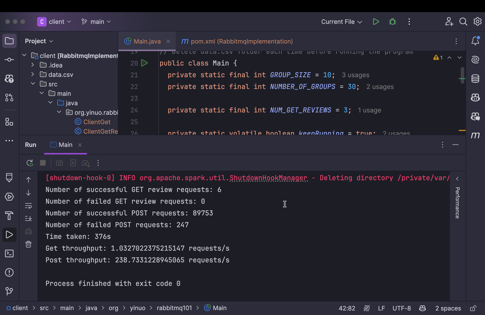
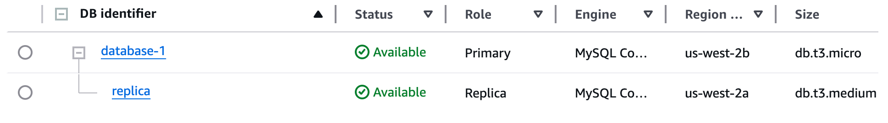
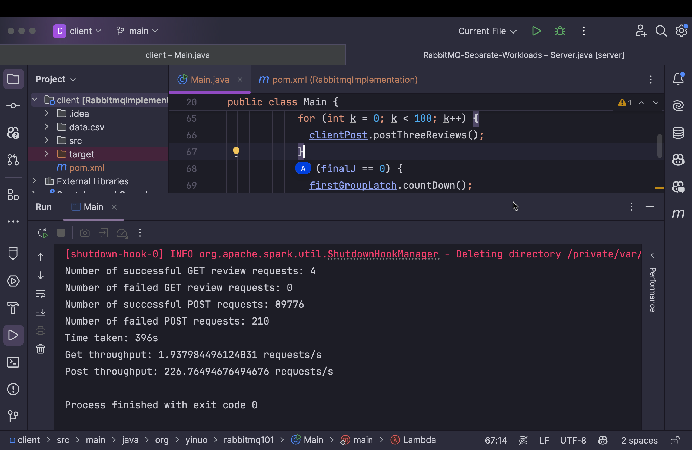

# Report

## System Architecture

The main components include:

1. Server.java (Java Servlets and producer side for RabbitMQ, deployed on AWS EC2)
2. MQConsumer.java: (consumer side for RabbitMQ, deployed on AWS EC2 as well, using @WebListener)
3. MySQL Database (AWS RDS)

On the server side, it handles income requests in three steps:

1. Handles HTTP requests with Servlets
2. Processes requests and forward important data to RabbitMQ
3. RabbitMQ sends mySQL queries to database

Message flow as in posting reviews:
1. Users submit a review on the client side (POST /review/{like|dislike}/{albumId})
2. Server receives the request, after processing the data, publishes the review message to RabbitMQ
3. RabbitMQ stores the message in likeQueue
4. MQConsumer reads the message and inserts it into the MySQL database

**In this project, the client sends PostReview and GetReview requests to the server. The difference between post and get lies in the post requests is forwarded by RabbitMQ while get requests go to the database directly.**

## Results

In the beginning, the read throughput was overwhelmingly low.

I had an assumption that it might be due to rabbitmq taking too much of database connections. To solve this potential issue, I added a read replica to the database and forwarded all read reviews requests to this replica.

Above is the replica setting.

However, as shown in the image above, read throughput did not increase. What's more, the post throughput decreases, possibly due to the existence of read replica, which causes overhead when sychronizing between main database and replica one.

Based on this observation, I have a temporary conclusion that read replica only increases throughput when database is the bottleneck. The current situation might be: it is the POST operations overwhelms the system.

